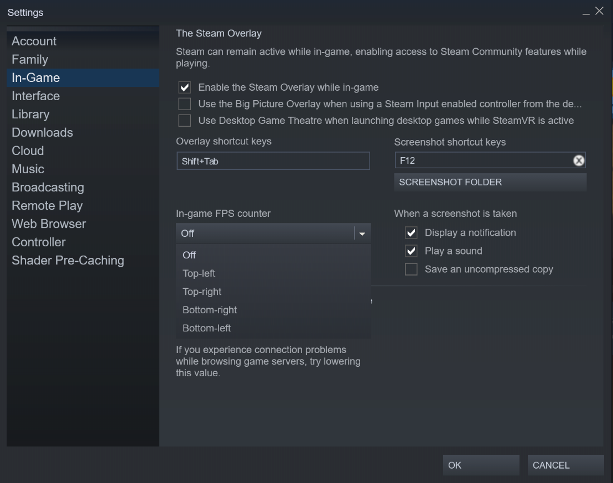
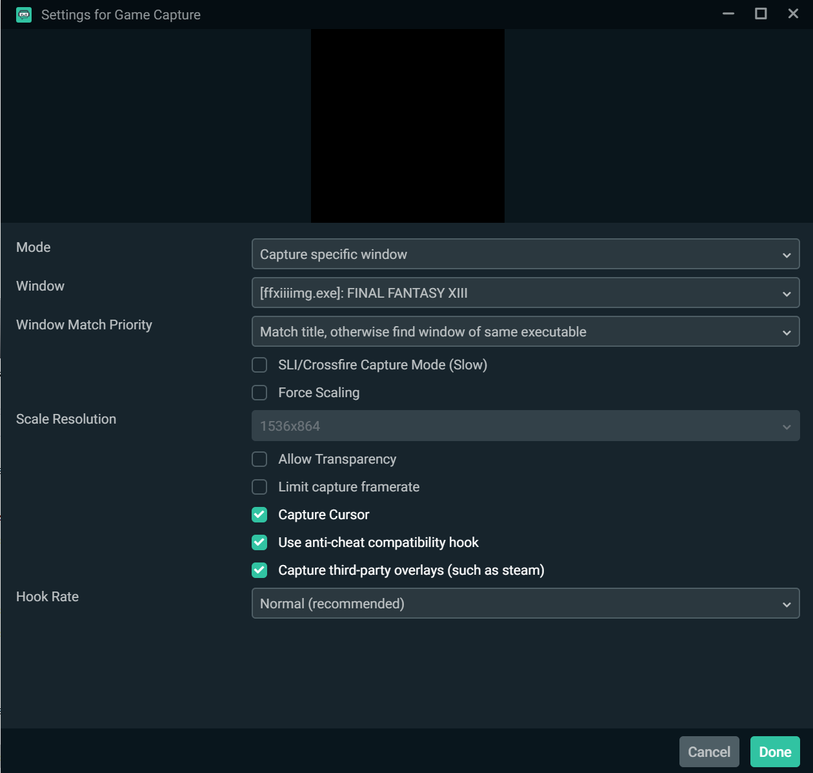

# How to install the FPS Fix

## Instructions
1. Download the two files located here, [dinput8.dll](./dinput8.dll) and [FF13Fix.ini](./FF13Fix.ini).
2. Place these files in your FFXII Steam install directory, under `white_data/prog/win/bin`. The full path, assuming default installation, should be `C:\Program Files (x86)\Steam\steamapps\common\FINAL FANTASY XIII\white_data\prog\win\bin`
3. If you wish to reduce the framerate that your PC will run the game at, open the FF13Fix.ini and change the `FFXIIIIngameFrameRateLimit` value to whatever  you want.
IMPORTANT: Do not change this value to anything above 60. Doing so will, as of current rules, invalidate your run (and also make it a lot harder).
4. Configure an FPS counter to display on your game while running. There are two ways that you can do it, both described below.
5. Enjoy your run.

## FPS Counter
There are many ways that you can get an FPS counter to be displayed on your stream while you run this game. Here are a few examples of how to set them up.

### Steam Built in Overlay
1. Open up Steam, and go to View->Settings
2. Click on the In-Game category on the left
3. Set the In-game FPS counter to On by selecting one of the corners for it to display in.

### DX-Tory
1. Download [DX-Tory](https://dxtory.en.lo4d.com/windows)
2. Install it, following all of the setup instructions

### After enabling FPS Counter
1. Make sure that you enable capturing third-party overlays in whatever capture software you are using.
2. In Streamlabs OBS, this can be found by double clicking your `Game Capture` and clicking the checkbox for `Capture third-party overlays (such as steam)

